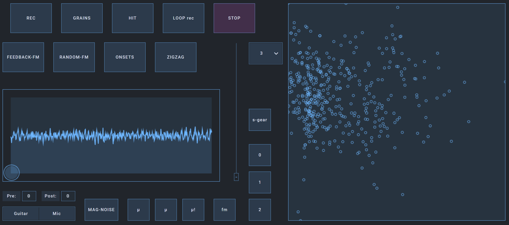

This is the system that I've been using for live improvisation. It allows the processing of the guitar signal, as well as manipulating in real time the sound of the rest of the musicians. I'm continuously experimenting with this, and many parameters are adjusted specifically according to band/project, so consider this repository a mostly held-together-with-tape snapshot of the code as it evolves.

To hear an example, I used this system extensively on [Corrosion](https://tavarestrocadoward.bandcamp.com/album/corrosion), the latest recording of the Ward/Trocado/Tavares trio.

This is written in Common Lisp, and uses the [SuperCollider](https://supercollider.github.io/) audio server and [Open Stage Control](http://openstagecontrol.ammd.net/) for the user interface. See [this tutorial](https://nunotrocado.com/software/cl-collider-tutorial-1.html) for how I use Supercollider with Lisp.

## Installation

If you want to try it for yourself but are unfamiliar with Lisp, follow these steps for a quickstart:

1. Install [SuperCollider](https://supercollider.github.io/).
2. Follow [these instructions](https://lisp-lang.org/learn/getting-started/) to install SBCL and quicklisp.
3. Clone this repository into `~/quicklisp/local-projects`.
4. Start with `run.sh` (Linux and macOS) or `run.bat` (Windows).

## Description

The user interface is designed for touch screen. All buttons and the vertical fader can also be controlled with a midi pedalboard.

- **REC**:  records sound input to a buffer
- **GRAINS**:  activate the XY pad for granular synthesis
- **HIT**:  plays random percussive bits from the recorded audio
- **LOOP**:  glitch looper; hold to rec, tap to play, double tap to reset; the audio is transformed each time it loops
- **STOP**:  quick fade out of everything playing
- **FEEDBACK FM**:  tracks input pitch to drive an fm synth; gets chaotic
- **RANDOM FM**:  fm noises that react to the input amplitude (in inverse, loud input → no noise; silence → lots of noise)
- **ONSETS**:  detects input onsets in real time and plays short harsh synth sounds 
- **ZIGZAG**:  modulates playhead speed and direction
- **Pre, Post, Guitar, Mic**:  select audio interface active inputs for recording and real time processing
- **MAG NOISE**:  frequency-domain processing of the buffer, multiplying bin magnitudes by noise
- **μ1, μ2, μ!, fm**:  percussive one-shot synth sounds
- **1, 2, 3**:  loads pre-recorded audio files into the buffer
- **"s -gear"**:  opens the ui for the amp modeler, which is running as a vst in the background
- **large vertical fader**:  simultaneously controls a number of parameters in all of the effects/modules
- **rectangular XY pad on the left**:  shows a waveform for the present audio buffer, and controls the position (X) and amplitude (Y) of the granular synthesis module
- **large XY pad on the right**:  plots a corpus of small sound bits, segmented and analyzed with the flucoma library (following [this technique](https://learn.flucoma.org/learn/2d-corpus-explorer/)); touching triggers the nearest individual sound segment
